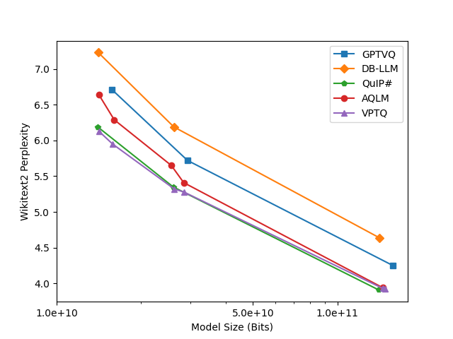

# VPTQ: Extreme Low-bit Vector Post-Training Quantization for Large Language Models

## TL;DR

**Vector Post-Training Quantization (VPTQ)** is a novel Post-Training Quantization method that leverages **Vector Quantization** to high accuracy on LLMs at an extremely low bit-width (<2-bit). 
VPTQ can compress 70B, even the 405B model, to 1-2 bits without retraining and maintain high accuracy.

* Better Accuracy on 1-2 bits
* Lightweight Quantization Algorithm: only cost ~17 hours to quantize 405B Llama-3.1
* Agile Quantization Inference: low decode overhead, best throughput, and TTFT

## [**Tech Report**](https://github.com/microsoft/VPTQ/blob/main/VPTQ_tech_report.pdf)

Scaling model size significantly challenges the deployment and inference of Large Language Models (LLMs). Due to the redundancy in LLM weights, recent research has focused on pushing weight-only quantization to extremely low-bit (even down to 2 bits). It reduces memory requirements, optimizes storage costs, and decreases memory bandwidth needs during inference. However, due to numerical representation limitations, traditional scalar-based weight quantization struggles to achieve such extreme low-bit. Recent research on Vector Quantization (VQ) for LLMs has demonstrated the potential for extremely low-bit model quantization by compressing vectors into indices using lookup tables.

Read tech report at [**Tech Report**](https://github.com/microsoft/VPTQ/blob/main/VPTQ_tech_report.pdf) and [**arXiv Paper**](https://arxiv.org/pdf/2409.17066)

### Early Results from Tech Report
VPTQ achieves better accuracy and higher throughput with lower quantization overhead across models of different sizes. The following experimental results are for reference only; VPTQ can achieve better outcomes under reasonable parameters, especially in terms of model accuracy and inference speed.



| Model | bitwidth | W2↓  | C4↓  | AvgQA↑ | tok/s↑ | mem(GB) | cost/h↓ |
| ----------- | -------- | ---- | ---- | ------ | ------ | ------- | ------- |
| LLaMA-2 7B  | 2.02     | 6.13 | 8.07 | 58.2   | 39.9   | 2.28    | 2       |
|             | 2.26     | 5.95 | 7.87 | 59.4   | 35.7   | 2.48    | 3.1     |
| LLaMA-2 13B | 2.02     | 5.32 | 7.15 | 62.4   | 26.9   | 4.03    | 3.2     |
|             | 2.18     | 5.28 | 7.04 | 63.1   | 18.5   | 4.31    | 3.6     |
| LLaMA-2 70B | 2.07     | 3.93 | 5.72 | 68.6   | 9.7    | 19.54   | 19      |
|             | 2.11     | 3.92 | 5.71 | 68.7   | 9.7    | 20.01   | 19      |

## Installation and Evaluation

### Dependencies

- python 3.10+
- torch >= 2.2.0
- transformers >= 4.44.0
- Accelerate >= 0.33.0
- latest datasets

### Installation

> Preparation steps that might be needed: Set up CUDA PATH.
```bash
export PATH=/usr/local/cuda-12/bin/:$PATH  # set dependent on your environment
```

*Will Take several minutes to compile CUDA kernels*, please be patient. Current compilation builds on SM 8.0, 8,6, 9.0 to reduce the compilation time. You can modify the `setup.py` to build on your specific architecture.

```bash
pip install git+https://github.com/microsoft/VPTQ.git --no-build-isolation
```

### Models from Open Source Community

⚠️ The repository only provides a method of model quantization algorithm. 

⚠️ The open-source community [VPTQ-community](https://huggingface.co/VPTQ-community) provides models based on the technical report and quantization algorithm. 

⚠️ The repository cannot guarantee the performance of those models.

|      Model Series      | Collections |
|:----------------------:|:-----------:|
|  Llama 3.1 8B Instruct |     [HF 🤗](https://huggingface.co/collections/VPTQ-community/vptq-llama-31-8b-instruct-without-finetune-66f2b70b1d002ceedef02d2e)    |
| Llama 3.1 70B Instruct |     [HF 🤗](https://huggingface.co/collections/VPTQ-community/vptq-llama-31-70b-instruct-without-finetune-66f2bf454d3dd78dfee2ff11)    |
|  Qwen 2.5 7B Instruct  |     [HF 🤗](https://huggingface.co/collections/VPTQ-community/vptq-qwen-25-7b-instruct-without-finetune-66f3e9866d3167cc05ce954a)    |
|  Qwen 2.5 72B Instruct |     [HF 🤗](https://huggingface.co/collections/VPTQ-community/vptq-qwen-25-72b-instruct-without-finetune-66f3bf1b3757dfa1ecb481c0)    |
|  Qwen 2.5 405B Instruct |     [HF 🤗](https://huggingface.co/collections/VPTQ-community/vptq-llama-31-405b-instruct-without-finetune-66f4413f9ba55e1a9e52cfb0)    |

### Language Generation Example
To generate text using the pre-trained model, you can use the following code snippet:

The model [*VPTQ-community/Meta-Llama-3.1-70B-Instruct-v8-k32768-0-woft*](https://huggingface.co/VPTQ-community/Meta-Llama-3.1-70B-Instruct-v8-k32768-0-woft) (~1.875 bit) is provided by open source community. The repository cannot guarantee the performance of those models.

```python
python -m vptq --model=VPTQ-community/Meta-Llama-3.1-70B-Instruct-v8-k32768-0-woft --prompt="Explain: Do Not Go Gentle into That Good Night"
```

### Terminal Chatbot Example 
Launching a chatbot:
Note that you must use a chat model for this to work

```python
python -m vptq --model=VPTQ-community/Meta-Llama-3.1-70B-Instruct-v8-k32768-0-woft --chat
```

### Python API Example
Using the Python API:

```python
import vptq
import transformers
tokenizer = transformers.AutoTokenizer.from_pretrained("VPTQ-community/Meta-Llama-3.1-70B-Instruct-v8-k32768-0-woft")
m = vptq.AutoModelForCausalLM.from_pretrained("VPTQ-community/Meta-Llama-3.1-70B-Instruct-v8-k32768-0-woft", device_map='auto')

inputs = tokenizer("Explain: Do Not Go Gentle into That Good Night", return_tensors="pt").to("cuda")
out = m.generate(**inputs, max_new_tokens=100, pad_token_id=2)
print(tokenizer.decode(out[0], skip_special_tokens=True))
```

### Gradio Web App Example
A environment variable is available to control share link or not. 
`export SHARE_LINK=1`
```
python -m vptq.app
```


## Road Map
- [ ] Merge the quantization algorithm into the public repository.
- [ ] Submit the VPTQ method to various inference frameworks (e.g., vLLM, llama.cpp).
- [ ] Improve the implementation of the inference kernel.
- [ ] **TBC**

## Project main members: 
* Yifei Liu (@lyf-00)
* Jicheng Wen (@wejoncy)
* Yang Wang (@YangWang92)

## Acknowledgement

* We thank for **James Hensman** for his crucial insights into the error analysis related to Vector Quantization (VQ), and his comments on LLMs evaluation are invaluable to this research.
* We are deeply grateful for the inspiration provided by the papers QUIP, QUIP#, GPTVQ, AQLM, WoodFisher, GPTQ, and OBC.

## Publication

EMNLP 2024 Main
```bibtex
@inproceedings{
  vptq,
  title={VPTQ: Extreme Low-bit Vector Post-Training Quantization for Large Language Models},
  author={Yifei Liu and
          Jicheng Wen and
          Yang Wang and
          Shengyu Ye and
          Li Lyna Zhang and
          Ting Cao and
          Cheng Li and
          Mao Yang},
  booktitle={The 2024 Conference on Empirical Methods in Natural Language Processing},
  year={2024},
}
```

## Limitation of VPTQ
* ⚠️ VPTQ should only be used for research and experimental purposes. Further testing and validation are needed before you use it.
* ⚠️ The repository only provides a method of model quantization algorithm. The open-source community may provide models based on the technical report and quantization algorithm by themselves, but the repository cannot guarantee the performance of those models.
* ⚠️ VPTQ is not capable of testing all potential applications and domains, and VPTQ cannot guarantee the accuracy and effectiveness of VPTQ across other tasks or scenarios.
* ⚠️ Our tests are all based on English texts; other languages are not included in the current testing.

## Contributing

This project welcomes contributions and suggestions.  Most contributions require you to agree to a
Contributor License Agreement (CLA) declaring that you have the right to, and actually do, grant us
the rights to use your contribution. For details, visit https://cla.opensource.microsoft.com.

When you submit a pull request, a CLA bot will automatically determine whether you need to provide
a CLA and decorate the PR appropriately (e.g., status check, comment). Simply follow the instructions
provided by the bot. You will only need to do this once across all repos using our CLA.

This project has adopted the [Microsoft Open Source Code of Conduct](https://opensource.microsoft.com/codeofconduct/).
For more information see the [Code of Conduct FAQ](https://opensource.microsoft.com/codeofconduct/faq/) or
contact [opencode@microsoft.com](mailto:opencode@microsoft.com) with any additional questions or comments.

## Trademarks

This project may contain trademarks or logos for projects, products, or services. Authorized use of Microsoft 
trademarks or logos is subject to and must follow 
[Microsoft's Trademark & Brand Guidelines](https://www.microsoft.com/en-us/legal/intellectualproperty/trademarks/usage/general).
Use of Microsoft trademarks or logos in modified versions of this project must not cause confusion or imply Microsoft sponsorship.
Any use of third-party trademarks or logos are subject to those third-party's policies.
