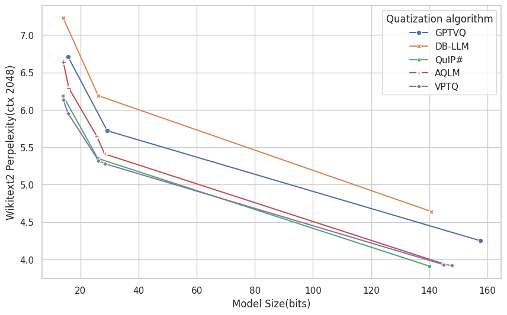

# VPTQ: Extreme Low-bit Vector Post-Training Quantization for Large Language Models
## VPTQ results
The figure below shows a comparison of ultra-low bit (2-bit) quantization using VPTQ and other SOTA algorithms on the LLaMA-2 model.

VPTQ achieves better accuracy and higher throughput with lower quantization overhead across models of different sizes.
| Model | bitwidth | W2↓  | C4↓  | AvgQA↑ | tok/s↑ | mem(GB) | cost/h↓ |
| ----------- | -------- | ---- | ---- | ------ | ------ | ------- | ------- |
| LLaMA-2 7B  | 2.02     | 6.13 | 8.07 | 58.2   | 39.9   | 2.28    | 2       |
|             | 2.26     | 5.95 | 7.87 | 59.4   | 35.7   | 2.48    | 3.1     |
| LLaMA-2 13B | 2.02     | 5.32 | 7.15 | 62.4   | 26.9   | 4.03    | 3.2     |
|             | 2.18     | 5.28 | 7.04 | 63.1   | 18.5   | 4.31    | 3.6     |
| LLaMA-2 70B | 2.07     | 3.93 | 5.72 | 68.6   | 9.7    | 19.54   | 19      |
|             | 2.11     | 3.92 | 5.71 | 68.7   | 9.7    | 20.01   | 19      |
| LLaMA-3 8B  | 2.08     | 9.29 |      | 60.2   |        |         |         |
|             | 2.24     | 9.19 |      | 62.7   |        |         |         |
| LLaMA-3 70B | 2.02     | 5.6  | /    | 70.9   |        |         |         |
|             | 2.07     | 5.66 | /    | 70.7   |        |         |         |
| Mistral 7B  | 2.04     | 6.32 | 9.17 | 63.2   |        |         |         |

## Contributing
